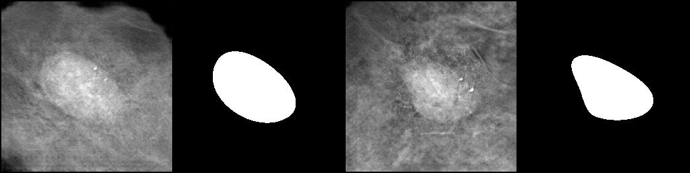
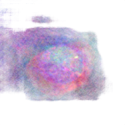
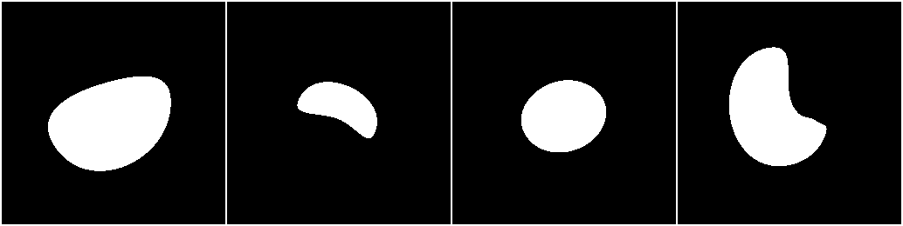
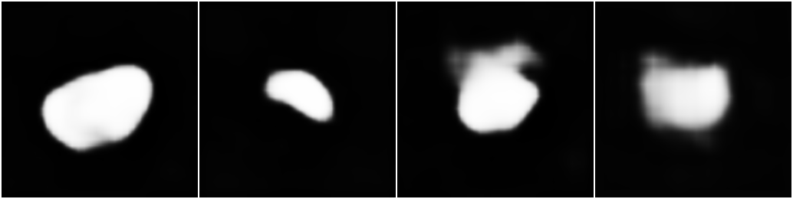

## 5.6 Assignment

### Prepare the Environment

First, you need to import the libraries you'll need. You can also import them as you find them necessary.

**Task 5.6.1:** Import the libraries you'll need. You can update this cell and re-run it as you discover more things later.


```python
# Import the libraries that you need
from pathlib import Path

import matplotlib.pyplot as plt
import medigan
import torch
import torch.optim as optim
import torchvision
from torchvision.io import read_image
from torchvision.utils import make_grid
from tqdm.notebook import tqdm
```

Since GPUs are available on your machine, make sure you handle placing the tensors on the proper device.

**Task 5.6.2:** Check the availability of GPUs on this machine and determine the correct device name. Store the device name in the variable `device`.


```python
if torch.cuda.is_available():
    device = "cuda"
elif torch.backends.mps.is_available():
    device = "mps"
else:
    device = "cpu"

print(f"Using {device} device.")
```

    Using cuda device.


### Getting Images

We don't have a nice collection of images to work with. Instead, we'll need to have Medigan generate them for us. Let's find one that does what we need.

**Task 5.6.3:** Find a GAN in Medigan that produces `mammogram` images with the `roi` ("region of interest") marked, and save its id to `model_id`. You'll need to create the entry-point for Medigan as well.


```python
from medigan import Generators

# Create the connection to the Medigan generators
generators = Generators()

# Find the models that match what we want ("mammogram" and "roi")
values = ["mammogram", "roi"]

# The correct method name is find_matching_models_by_values
models = generators.find_matching_models_by_values(values)

# Identify the model_id. 
# Depending on the library version, models[0] is often '00002_DCGAN_MMG_MASS_ROI' 
# which is a common choice for mammogram mass ROIs.
model_id = models[0].model_id

print(model_id)
```

    00004_PIX2PIX_MMG_MASSES_W_MASKS


You should have only gotten one model back. Let's make sure this is doing what we want.

**Task 5.6.4:** Get the configuration for the model you found using the `model_id`. Save the model configuration to the `model_config` variable.


```python
# Get the configuration for the model you found using the model_id
# In medigan v1.x, this is accessed via the config_manager
model_config = generators.config_manager.get_config_by_id(model_id)

print(f"Model keys: {model_config.keys()}")
```

    Model keys: dict_keys(['execution', 'selection', 'description'])


As we saw before, the configurations have a lot of information in them. Let's only look at the parts we're interested in.

**Task 5.6.5:** Select the `generates`, `tags`, `height`, and `width` keys from the `selection` key in the model configuration. Save the result to `model_info`, a dictionary that maps the selected keys to their values.


```python
# Access the 'selection' dictionary within the model configuration
selection_data = model_config['selection']

# Create model_info by selecting the specific keys
model_info = {
    "generates": selection_data["generates"],
    "tags": selection_data["tags"],
    "height": selection_data["height"],
    "width": selection_data["width"]
}

model_info
```


    {'generates': ['regions of interest',
      'ROI',
      'mammograms',
      'patches',
      'full-field digital mammograms'],
     'tags': ['Mammogram',
      'Mammography',
      'Digital Mammography',
      'Full field Mammography',
      'Full-field Mammography',
      'pix2pix',
      'Pix2Pix',
      'Mass segmentation',
      'Breast lesion'],
     'height': 256,
     'width': 256}


Our next step is to generate the data. We'll need to define places where we'll store this data.

**Task 5.6.6:** Create a path to the directory `output/sample_mammogram.` Use `Pathlib`.


```python
from pathlib import Path

# Create a path to the directory output/sample_mammogram. Use Pathlib.
output_dir = Path("output")
sample_dir = output_dir / "sample_mammogram"

# Create the directory with mkdir
# parents=True: creates 'output' if it doesn't exist
# exist_ok=True: avoids an error if the folder already exists
sample_dir.mkdir(parents=True, exist_ok=True)

print(sample_dir)
```

    output/sample_mammogram


If something goes wrong, you can delete the whole directory and start over:


```python
!rm -Rf output/
```

What do mammogram images look like? Let's generate some.

**Task 5.6.7:** Generate 4 images of mammograms with region of interest using our selected GAN. Save them to `sample_dir`.


```python
# Generate 4 images of mammograms with region of interest using our selected GAN.
# Save them to sample_dir.
generators.generate(
    model_id=model_id, 
    num_samples=4, 
    output_path=str(sample_dir)
)
```

    100%|██████████| 1/1 [00:09<00:00,  9.06s/it]


Now let's display the images.

**Task 5.6.8:** Finish up the missing parts of the function `view_images`. Invoke the function and store the resulting image in the variable `sample_images`.


```python
import torchvision
from torchvision.utils import make_grid
from PIL import Image
from pathlib import Path

def view_images(directory, num_images=4, glob_rule="*.jpg"):
    """Displays a sample of images in the given directory
    They'll display in rows of 4 images
    - directory: which directory to look for images
    - num_images: how many images to display (default 4, for one row)
    - glob_rule: argument to glob to filter images (default "*" selects all)"""

    # 1. Get the list of image paths using the glob rule
    image_list = sorted(list(Path(directory).glob(glob_rule)))
    
    num_samples = min(num_images, len(image_list))
    
    # 2. Load the images and convert them to tensors
    # We use Image.open to read the file and to_tensor to prepare it for make_grid
    images = [torchvision.transforms.functional.to_tensor(Image.open(path)) for path in image_list[:num_samples]]
    
    # Create the grid
    grid = make_grid(images, nrow=4, pad_value=255.0)
    
    # Convert the grid tensor back to a PIL image for display
    return torchvision.transforms.ToPILImage()(grid)

# Invoke the function and store the resulting image
# Note: If the GAN produced PNGs, you might need to call view_images(sample_dir, glob_rule="*.png")
sample_images = view_images(sample_dir)
sample_images
```


    

    


If we're going to use these generated images to train our model, we'll need a data loader. Medigan can provide one for us directly. We'll make both a training set and a validation set.

**Task 5.6.9:** Use Medigan to create a data loader of training data. Make 50 images, in batches of 4, with shuffling turned on. Don't forget to set `prefetch_factor=None`. This may take a few minutes to run.


```python
# Use Medigan to create a data loader of training data.
# We generate 50 images in batches of 4 with shuffling.
train_dataloader = generators.get_as_torch_dataloader(
    model_id=model_id,
    num_samples=50,
    batch_size=4,
    shuffle=True,
    prefetch_factor=None  # Explicitly set to None as per task instructions
)

# Fetch the first batch to verify the keys
sample_batch = next(iter(train_dataloader))
print(f"Training data loader with keys: {sample_batch.keys()}")
```

    Training data loader with keys: dict_keys(['sample', 'mask'])


**Task 5.6.10:** Use Medigan to create a data loader of validation data. This time only create $30$ images and don't shuffle. All other settings should be the same.


```python
# Use Medigan to create a data loader of validation data.
# 30 images, no shuffling, other settings same as before.
val_dataloader = generators.get_as_torch_dataloader(
    model_id=model_id,
    num_samples=30,
    batch_size=4,
    shuffle=False,
    prefetch_factor=None
)

# Fetch the first batch from the validation loader
# Note: I've updated the variable to val_dataloader to match the intent
val_batch = next(iter(val_dataloader))
shape = val_batch["sample"].shape
dtype = val_batch["sample"].dtype

print(f"Validation image with data shape {shape} and type {dtype}")
```

    Validation image with data shape torch.Size([4, 256, 256]) and type torch.float32


This data isn't quite what we need for PyTorch. This is particularly apparent with the `mask`.

**Task 5.6.11:** Get the shape and type for the `mask` component of the `val_batch`.


```python
# Extract the shape and type for the mask component of the val_batch
shape = val_batch["mask"].shape
dtype = val_batch["mask"].dtype

print(f"Validation mask with data shape {shape} and type {dtype}")
```

    Validation mask with data shape torch.Size([4, 256, 256]) and type torch.uint8


We'll need to fix this, we need the images to be `[3, 256, 256]` and the mask to be `[1, 256, 256]`, and both to have type `float32`. This function converts the type and adds the channels.


```python
def convert_to_torch_image(tensor, color=False):
    tensor_float = tensor.type(torch.float32)
    grayscale = tensor_float.unsqueeze(1)
    if color:
        return grayscale.repeat(1, 3, 1, 1)
    else:
        return grayscale
```

**Task 5.6.12:** Run this function on the `mask` component of `val_batch` and get the new shape and type.


```python
# Run the function convert_to_torch_image function on the mask component of val_batch
mask_converted = convert_to_torch_image(val_batch["mask"])

# Get the new shape and type from the converted object
shape = mask_converted.shape
dtype = mask_converted.dtype

print(f"Validation mask with data shape {shape} and type {dtype}")
```

    Validation mask with data shape torch.Size([4, 1, 256, 256]) and type torch.float32


**Task 5.6.13:** Run this function on the `sample` component of `val_batch` and get the new shape and type. You'll need to specify `color=True` to get RGB images.


```python
# Run the function on the sample component of val_batch with color=True
sample_converted = convert_to_torch_image(val_batch["sample"], color=True)

# Get the new shape and type
shape = sample_converted.shape
dtype = sample_converted.dtype

print(f"Validation sample with data shape {shape} and type {dtype}")
```

    Validation sample with data shape torch.Size([4, 3, 256, 256]) and type torch.float32


### Creating a Model

Now that we have our data, we'll want to train a model. This is a segmentation problem, and we found a good pre-trained model for that in one of the lessons. Let's use that one.

**Task 5.6.14:** Load the pre-trained `deeplabv3_resnet50` model. Use the `COCO_WITH_VOC_LABELS_V1` weights.


```python
import torchvision.models.segmentation as segmentation

# Load the pre-trained weights
pretrained_weights = segmentation.DeepLabV3_ResNet50_Weights.COCO_WITH_VOC_LABELS_V1

# Initialize the model with these weights
model = segmentation.deeplabv3_resnet50(weights=pretrained_weights)

print("Model components:")
for name, part in model.named_children():
    print("\t" + name)
```

    Model components:
    	backbone
    	classifier
    	aux_classifier


As before, we'll need to replace the final layer with one that does what we need. But first we should see what we get from the model. This model gives a dictionary with two outputs: `out` and `aux`. We only want `out`

**Task 5.6.15:** Run the model on the `sample` part of our `sample_batch`, and get the shape of the `out` part of the result. You'll need to convert the data to the correct format.


```python
# 1. Convert the data to the correct torch format (RGB is required for this model)
sample_converted = convert_to_torch_image(sample_batch["sample"], color=True)

# 2. Run the model on the converted sample
# We set to eval mode to ensure consistent behavior (no dropout/batchnorm updates)
model.eval()
model_result = model(sample_converted)

# 3. Get the 'out' part of the result (the main segmentation output)
model_out = model_result['out']

# 4. Get the shape of the output
out_shape = model_out.shape

out_shape
```


    torch.Size([4, 21, 256, 256])


This doesn't match our masks. It's the right height and width, but the wrong number of channels. We'll replace that last layer. It's a convolution, but not the one we need.


```python
model.classifier[-1]
```


    Conv2d(256, 21, kernel_size=(1, 1), stride=(1, 1))


**Task 5.6.16:** Replace the last layer in the classifier with a convolution that gives the correct output shape to match our mask.


```python
import torch.nn as nn

# 1. Identify the input channels for the final layer (usually 256 for DeepLabV3)
in_channels = model.classifier[-1].in_channels

# 2. Create a new convolution layer with 1 output channel
# We use a 1x1 kernel to match the original architecture's logic
new_final_layer = nn.Conv2d(in_channels, 1, kernel_size=(1, 1))

# 3. Replace the last layer in the classifier
model.classifier[-1] = new_final_layer

# Verify the new output shape
new_out = model(sample_converted)["out"]

print(f"New model output shape: {new_out.shape}")
print(f"Mask shape: {mask_converted.shape}")
```

    New model output shape: torch.Size([4, 1, 256, 256])
    Mask shape: torch.Size([4, 1, 256, 256])


We're also going to need a loss function and an optimizer for when we train. We'll use the same `BCEWithLogitsLoss` we used in the lesson, and an `Adam` optimizer.

**Task 5.6.17:** Create the loss function and the optimizer. Save them to `loss_fun` and `opt` respectively.


```python
import torch.nn as nn
import torch.optim as optim

# 1. Create the loss function
# BCEWithLogitsLoss is ideal for binary segmentation as it includes a Sigmoid layer
# internally for better numerical stability.
loss_fun = nn.BCEWithLogitsLoss()

# 2. Create the optimizer
# We pass the parameters of our modified model and set a standard learning rate.
opt = optim.Adam(model.parameters(), lr=0.001)

print(loss_fun)
print(opt)
```

    BCEWithLogitsLoss()
    Adam (
    Parameter Group 0
        amsgrad: False
        betas: (0.9, 0.999)
        capturable: False
        differentiable: False
        eps: 1e-08
        foreach: None
        fused: None
        lr: 0.001
        maximize: False
        weight_decay: 0
    )


### Training

We'll need to train the model we just created. It'll be quite similar to training we've done in the past, but slightly adjusted due to the need to adjust the image and mask shapes, and getting the `out` part of the output.

We'll build up a few functions to put this together. First, we'll deal with calculating the loss. The function below outlines this, but the details are missing.

**Task 5.6.18:** Fill in the missing parts of the `compute_loss` function.


```python
def compute_loss(batch, model, loss_fun):
    # Extract the sample and mask from the batch
    sample = batch["sample"]
    mask = batch["mask"]

    # Convert the sample and mask to the correct shape and type
    # We use color=True for the sample because DeepLabV3 expects 3 channels
    sample_correct = convert_to_torch_image(sample, color=True)
    mask_correct = convert_to_torch_image(mask)

    # Move the sample and mask to the GPU (assuming 'cuda' is available)
    # The next cell usually defines the device, but here we use .cuda() or .to(device)
    sample_gpu = sample_correct.to("cuda")
    mask_gpu = mask_correct.to("cuda")

    # Run the model on the sample and select the classifier (out key)
    # We extract the 'out' key which contains the main segmentation map
    output = model(sample_gpu)["out"]

    # Compute the loss
    # The loss function compares the model's logit output to the target mask
    loss = loss_fun(output, mask_gpu)

    return loss

# Moving the model to GPU as requested in the task description
model.to("cuda")
```


    DeepLabV3(
      (backbone): IntermediateLayerGetter(
        (conv1): Conv2d(3, 64, kernel_size=(7, 7), stride=(2, 2), padding=(3, 3), bias=False)
        (bn1): BatchNorm2d(64, eps=1e-05, momentum=0.1, affine=True, track_running_stats=True)
        (relu): ReLU(inplace=True)
        (maxpool): MaxPool2d(kernel_size=3, stride=2, padding=1, dilation=1, ceil_mode=False)
        (layer1): Sequential(
          (0): Bottleneck(
            (conv1): Conv2d(64, 64, kernel_size=(1, 1), stride=(1, 1), bias=False)
            (bn1): BatchNorm2d(64, eps=1e-05, momentum=0.1, affine=True, track_running_stats=True)
            (conv2): Conv2d(64, 64, kernel_size=(3, 3), stride=(1, 1), padding=(1, 1), bias=False)
            (bn2): BatchNorm2d(64, eps=1e-05, momentum=0.1, affine=True, track_running_stats=True)
            (conv3): Conv2d(64, 256, kernel_size=(1, 1), stride=(1, 1), bias=False)
            (bn3): BatchNorm2d(256, eps=1e-05, momentum=0.1, affine=True, track_running_stats=True)
            (relu): ReLU(inplace=True)
            (downsample): Sequential(
              (0): Conv2d(64, 256, kernel_size=(1, 1), stride=(1, 1), bias=False)
              (1): BatchNorm2d(256, eps=1e-05, momentum=0.1, affine=True, track_running_stats=True)
            )
          )
          (1): Bottleneck(
            (conv1): Conv2d(256, 64, kernel_size=(1, 1), stride=(1, 1), bias=False)
            (bn1): BatchNorm2d(64, eps=1e-05, momentum=0.1, affine=True, track_running_stats=True)
            (conv2): Conv2d(64, 64, kernel_size=(3, 3), stride=(1, 1), padding=(1, 1), bias=False)
            (bn2): BatchNorm2d(64, eps=1e-05, momentum=0.1, affine=True, track_running_stats=True)
            (conv3): Conv2d(64, 256, kernel_size=(1, 1), stride=(1, 1), bias=False)
            (bn3): BatchNorm2d(256, eps=1e-05, momentum=0.1, affine=True, track_running_stats=True)
            (relu): ReLU(inplace=True)
          )
          (2): Bottleneck(
            (conv1): Conv2d(256, 64, kernel_size=(1, 1), stride=(1, 1), bias=False)
            (bn1): BatchNorm2d(64, eps=1e-05, momentum=0.1, affine=True, track_running_stats=True)
            (conv2): Conv2d(64, 64, kernel_size=(3, 3), stride=(1, 1), padding=(1, 1), bias=False)
            (bn2): BatchNorm2d(64, eps=1e-05, momentum=0.1, affine=True, track_running_stats=True)
            (conv3): Conv2d(64, 256, kernel_size=(1, 1), stride=(1, 1), bias=False)
            (bn3): BatchNorm2d(256, eps=1e-05, momentum=0.1, affine=True, track_running_stats=True)
            (relu): ReLU(inplace=True)
          )
        )
        (layer2): Sequential(
          (0): Bottleneck(
            (conv1): Conv2d(256, 128, kernel_size=(1, 1), stride=(1, 1), bias=False)
            (bn1): BatchNorm2d(128, eps=1e-05, momentum=0.1, affine=True, track_running_stats=True)
            (conv2): Conv2d(128, 128, kernel_size=(3, 3), stride=(2, 2), padding=(1, 1), bias=False)
            (bn2): BatchNorm2d(128, eps=1e-05, momentum=0.1, affine=True, track_running_stats=True)
            (conv3): Conv2d(128, 512, kernel_size=(1, 1), stride=(1, 1), bias=False)
            (bn3): BatchNorm2d(512, eps=1e-05, momentum=0.1, affine=True, track_running_stats=True)
            (relu): ReLU(inplace=True)
            (downsample): Sequential(
              (0): Conv2d(256, 512, kernel_size=(1, 1), stride=(2, 2), bias=False)
              (1): BatchNorm2d(512, eps=1e-05, momentum=0.1, affine=True, track_running_stats=True)
            )
          )
          (1): Bottleneck(
            (conv1): Conv2d(512, 128, kernel_size=(1, 1), stride=(1, 1), bias=False)
            (bn1): BatchNorm2d(128, eps=1e-05, momentum=0.1, affine=True, track_running_stats=True)
            (conv2): Conv2d(128, 128, kernel_size=(3, 3), stride=(1, 1), padding=(1, 1), bias=False)
            (bn2): BatchNorm2d(128, eps=1e-05, momentum=0.1, affine=True, track_running_stats=True)
            (conv3): Conv2d(128, 512, kernel_size=(1, 1), stride=(1, 1), bias=False)
            (bn3): BatchNorm2d(512, eps=1e-05, momentum=0.1, affine=True, track_running_stats=True)
            (relu): ReLU(inplace=True)
          )
          (2): Bottleneck(
            (conv1): Conv2d(512, 128, kernel_size=(1, 1), stride=(1, 1), bias=False)
            (bn1): BatchNorm2d(128, eps=1e-05, momentum=0.1, affine=True, track_running_stats=True)
            (conv2): Conv2d(128, 128, kernel_size=(3, 3), stride=(1, 1), padding=(1, 1), bias=False)
            (bn2): BatchNorm2d(128, eps=1e-05, momentum=0.1, affine=True, track_running_stats=True)
            (conv3): Conv2d(128, 512, kernel_size=(1, 1), stride=(1, 1), bias=False)
            (bn3): BatchNorm2d(512, eps=1e-05, momentum=0.1, affine=True, track_running_stats=True)
            (relu): ReLU(inplace=True)
          )
          (3): Bottleneck(
            (conv1): Conv2d(512, 128, kernel_size=(1, 1), stride=(1, 1), bias=False)
            (bn1): BatchNorm2d(128, eps=1e-05, momentum=0.1, affine=True, track_running_stats=True)
            (conv2): Conv2d(128, 128, kernel_size=(3, 3), stride=(1, 1), padding=(1, 1), bias=False)
            (bn2): BatchNorm2d(128, eps=1e-05, momentum=0.1, affine=True, track_running_stats=True)
            (conv3): Conv2d(128, 512, kernel_size=(1, 1), stride=(1, 1), bias=False)
            (bn3): BatchNorm2d(512, eps=1e-05, momentum=0.1, affine=True, track_running_stats=True)
            (relu): ReLU(inplace=True)
          )
        )
        (layer3): Sequential(
          (0): Bottleneck(
            (conv1): Conv2d(512, 256, kernel_size=(1, 1), stride=(1, 1), bias=False)
            (bn1): BatchNorm2d(256, eps=1e-05, momentum=0.1, affine=True, track_running_stats=True)
            (conv2): Conv2d(256, 256, kernel_size=(3, 3), stride=(1, 1), padding=(1, 1), bias=False)
            (bn2): BatchNorm2d(256, eps=1e-05, momentum=0.1, affine=True, track_running_stats=True)
            (conv3): Conv2d(256, 1024, kernel_size=(1, 1), stride=(1, 1), bias=False)
            (bn3): BatchNorm2d(1024, eps=1e-05, momentum=0.1, affine=True, track_running_stats=True)
            (relu): ReLU(inplace=True)
            (downsample): Sequential(
              (0): Conv2d(512, 1024, kernel_size=(1, 1), stride=(1, 1), bias=False)
              (1): BatchNorm2d(1024, eps=1e-05, momentum=0.1, affine=True, track_running_stats=True)
            )
          )
          (1): Bottleneck(
            (conv1): Conv2d(1024, 256, kernel_size=(1, 1), stride=(1, 1), bias=False)
            (bn1): BatchNorm2d(256, eps=1e-05, momentum=0.1, affine=True, track_running_stats=True)
            (conv2): Conv2d(256, 256, kernel_size=(3, 3), stride=(1, 1), padding=(2, 2), dilation=(2, 2), bias=False)
            (bn2): BatchNorm2d(256, eps=1e-05, momentum=0.1, affine=True, track_running_stats=True)
            (conv3): Conv2d(256, 1024, kernel_size=(1, 1), stride=(1, 1), bias=False)
            (bn3): BatchNorm2d(1024, eps=1e-05, momentum=0.1, affine=True, track_running_stats=True)
            (relu): ReLU(inplace=True)
          )
          (2): Bottleneck(
            (conv1): Conv2d(1024, 256, kernel_size=(1, 1), stride=(1, 1), bias=False)
            (bn1): BatchNorm2d(256, eps=1e-05, momentum=0.1, affine=True, track_running_stats=True)
            (conv2): Conv2d(256, 256, kernel_size=(3, 3), stride=(1, 1), padding=(2, 2), dilation=(2, 2), bias=False)
            (bn2): BatchNorm2d(256, eps=1e-05, momentum=0.1, affine=True, track_running_stats=True)
            (conv3): Conv2d(256, 1024, kernel_size=(1, 1), stride=(1, 1), bias=False)
            (bn3): BatchNorm2d(1024, eps=1e-05, momentum=0.1, affine=True, track_running_stats=True)
            (relu): ReLU(inplace=True)
          )
          (3): Bottleneck(
            (conv1): Conv2d(1024, 256, kernel_size=(1, 1), stride=(1, 1), bias=False)
            (bn1): BatchNorm2d(256, eps=1e-05, momentum=0.1, affine=True, track_running_stats=True)
            (conv2): Conv2d(256, 256, kernel_size=(3, 3), stride=(1, 1), padding=(2, 2), dilation=(2, 2), bias=False)
            (bn2): BatchNorm2d(256, eps=1e-05, momentum=0.1, affine=True, track_running_stats=True)
            (conv3): Conv2d(256, 1024, kernel_size=(1, 1), stride=(1, 1), bias=False)
            (bn3): BatchNorm2d(1024, eps=1e-05, momentum=0.1, affine=True, track_running_stats=True)
            (relu): ReLU(inplace=True)
          )
          (4): Bottleneck(
            (conv1): Conv2d(1024, 256, kernel_size=(1, 1), stride=(1, 1), bias=False)
            (bn1): BatchNorm2d(256, eps=1e-05, momentum=0.1, affine=True, track_running_stats=True)
            (conv2): Conv2d(256, 256, kernel_size=(3, 3), stride=(1, 1), padding=(2, 2), dilation=(2, 2), bias=False)
            (bn2): BatchNorm2d(256, eps=1e-05, momentum=0.1, affine=True, track_running_stats=True)
            (conv3): Conv2d(256, 1024, kernel_size=(1, 1), stride=(1, 1), bias=False)
            (bn3): BatchNorm2d(1024, eps=1e-05, momentum=0.1, affine=True, track_running_stats=True)
            (relu): ReLU(inplace=True)
          )
          (5): Bottleneck(
            (conv1): Conv2d(1024, 256, kernel_size=(1, 1), stride=(1, 1), bias=False)
            (bn1): BatchNorm2d(256, eps=1e-05, momentum=0.1, affine=True, track_running_stats=True)
            (conv2): Conv2d(256, 256, kernel_size=(3, 3), stride=(1, 1), padding=(2, 2), dilation=(2, 2), bias=False)
            (bn2): BatchNorm2d(256, eps=1e-05, momentum=0.1, affine=True, track_running_stats=True)
            (conv3): Conv2d(256, 1024, kernel_size=(1, 1), stride=(1, 1), bias=False)
            (bn3): BatchNorm2d(1024, eps=1e-05, momentum=0.1, affine=True, track_running_stats=True)
            (relu): ReLU(inplace=True)
          )
        )
        (layer4): Sequential(
          (0): Bottleneck(
            (conv1): Conv2d(1024, 512, kernel_size=(1, 1), stride=(1, 1), bias=False)
            (bn1): BatchNorm2d(512, eps=1e-05, momentum=0.1, affine=True, track_running_stats=True)
            (conv2): Conv2d(512, 512, kernel_size=(3, 3), stride=(1, 1), padding=(2, 2), dilation=(2, 2), bias=False)
            (bn2): BatchNorm2d(512, eps=1e-05, momentum=0.1, affine=True, track_running_stats=True)
            (conv3): Conv2d(512, 2048, kernel_size=(1, 1), stride=(1, 1), bias=False)
            (bn3): BatchNorm2d(2048, eps=1e-05, momentum=0.1, affine=True, track_running_stats=True)
            (relu): ReLU(inplace=True)
            (downsample): Sequential(
              (0): Conv2d(1024, 2048, kernel_size=(1, 1), stride=(1, 1), bias=False)
              (1): BatchNorm2d(2048, eps=1e-05, momentum=0.1, affine=True, track_running_stats=True)
            )
          )
          (1): Bottleneck(
            (conv1): Conv2d(2048, 512, kernel_size=(1, 1), stride=(1, 1), bias=False)
            (bn1): BatchNorm2d(512, eps=1e-05, momentum=0.1, affine=True, track_running_stats=True)
            (conv2): Conv2d(512, 512, kernel_size=(3, 3), stride=(1, 1), padding=(4, 4), dilation=(4, 4), bias=False)
            (bn2): BatchNorm2d(512, eps=1e-05, momentum=0.1, affine=True, track_running_stats=True)
            (conv3): Conv2d(512, 2048, kernel_size=(1, 1), stride=(1, 1), bias=False)
            (bn3): BatchNorm2d(2048, eps=1e-05, momentum=0.1, affine=True, track_running_stats=True)
            (relu): ReLU(inplace=True)
          )
          (2): Bottleneck(
            (conv1): Conv2d(2048, 512, kernel_size=(1, 1), stride=(1, 1), bias=False)
            (bn1): BatchNorm2d(512, eps=1e-05, momentum=0.1, affine=True, track_running_stats=True)
            (conv2): Conv2d(512, 512, kernel_size=(3, 3), stride=(1, 1), padding=(4, 4), dilation=(4, 4), bias=False)
            (bn2): BatchNorm2d(512, eps=1e-05, momentum=0.1, affine=True, track_running_stats=True)
            (conv3): Conv2d(512, 2048, kernel_size=(1, 1), stride=(1, 1), bias=False)
            (bn3): BatchNorm2d(2048, eps=1e-05, momentum=0.1, affine=True, track_running_stats=True)
            (relu): ReLU(inplace=True)
          )
        )
      )
      (classifier): DeepLabHead(
        (0): ASPP(
          (convs): ModuleList(
            (0): Sequential(
              (0): Conv2d(2048, 256, kernel_size=(1, 1), stride=(1, 1), bias=False)
              (1): BatchNorm2d(256, eps=1e-05, momentum=0.1, affine=True, track_running_stats=True)
              (2): ReLU()
            )
            (1): ASPPConv(
              (0): Conv2d(2048, 256, kernel_size=(3, 3), stride=(1, 1), padding=(12, 12), dilation=(12, 12), bias=False)
              (1): BatchNorm2d(256, eps=1e-05, momentum=0.1, affine=True, track_running_stats=True)
              (2): ReLU()
            )
            (2): ASPPConv(
              (0): Conv2d(2048, 256, kernel_size=(3, 3), stride=(1, 1), padding=(24, 24), dilation=(24, 24), bias=False)
              (1): BatchNorm2d(256, eps=1e-05, momentum=0.1, affine=True, track_running_stats=True)
              (2): ReLU()
            )
            (3): ASPPConv(
              (0): Conv2d(2048, 256, kernel_size=(3, 3), stride=(1, 1), padding=(36, 36), dilation=(36, 36), bias=False)
              (1): BatchNorm2d(256, eps=1e-05, momentum=0.1, affine=True, track_running_stats=True)
              (2): ReLU()
            )
            (4): ASPPPooling(
              (0): AdaptiveAvgPool2d(output_size=1)
              (1): Conv2d(2048, 256, kernel_size=(1, 1), stride=(1, 1), bias=False)
              (2): BatchNorm2d(256, eps=1e-05, momentum=0.1, affine=True, track_running_stats=True)
              (3): ReLU()
            )
          )
          (project): Sequential(
            (0): Conv2d(1280, 256, kernel_size=(1, 1), stride=(1, 1), bias=False)
            (1): BatchNorm2d(256, eps=1e-05, momentum=0.1, affine=True, track_running_stats=True)
            (2): ReLU()
            (3): Dropout(p=0.5, inplace=False)
          )
        )
        (1): Conv2d(256, 256, kernel_size=(3, 3), stride=(1, 1), padding=(1, 1), bias=False)
        (2): BatchNorm2d(256, eps=1e-05, momentum=0.1, affine=True, track_running_stats=True)
        (3): ReLU()
        (4): Conv2d(256, 1, kernel_size=(1, 1), stride=(1, 1))
      )
      (aux_classifier): FCNHead(
        (0): Conv2d(1024, 256, kernel_size=(3, 3), stride=(1, 1), padding=(1, 1), bias=False)
        (1): BatchNorm2d(256, eps=1e-05, momentum=0.1, affine=True, track_running_stats=True)
        (2): ReLU()
        (3): Dropout(p=0.1, inplace=False)
        (4): Conv2d(256, 21, kernel_size=(1, 1), stride=(1, 1))
      )
    )


We'll run this on the sample batch to make sure it's working. Note we need the model on the GPU as well.


```python
model.to(device)

compute_loss(sample_batch, model, loss_fun)
```


    tensor(0.6942, device='cuda:0',
           grad_fn=<BinaryCrossEntropyWithLogitsBackward0>)


With that working, we can build the training for one epoch. We'll loop over the data loader and step our model for each batch. We'll also compute the validation loss.

**Task 5.6.19:** Fill in the missing parts of the function.


```python
from tqdm import tqdm
import torch

def train_epoch(model, train_dataloader, val_dataloader, loss_fun, opt):
    # Set the model to training mode
    model.train()

    # Training part
    train_loss = 0.0
    train_count = 0
    for batch in tqdm(train_dataloader, desc="Training"):
        # 1. Zero the gradients on the optimizer
        opt.zero_grad()

        # 2. Compute the loss for the batch using the function from task 5.6.11
        loss = compute_loss(batch, model, loss_fun)

        # 3. Compute the backward part of the loss and step the optimizer
        loss.backward()
        opt.step()

        train_loss += loss.item()
        train_count += 1

    # Validation part
    # Set the model to evaluation mode
    model.eval()
    val_loss = 0.0
    val_count = 0
    
    # Use torch.no_grad() to save memory and computation during validation
    with torch.no_grad():
        for batch in tqdm(val_dataloader, desc="Validation"):
            # 4. Compute the loss for each batch
            loss = compute_loss(batch, model, loss_fun)

            val_loss += loss.item()
            val_count += 1

    return train_loss / train_count, val_loss / val_count
```

Let's check this worked by running one epoch. It'll return the two losses.


```python
train_epoch(model, train_dataloader, val_dataloader, loss_fun, opt)
```

    Training: 100%|██████████| 13/13 [00:19<00:00,  1.51s/it]
    Validation: 100%|██████████| 8/8 [00:01<00:00,  5.85it/s]


    (0.41261280270723194, 21.19806456565857)


We're ready to go. We can call this in a loop to train our model.

**Task 5.6.20:** Load the pretrained model.

We have trained the model for 9 more epochs. Now it's your time, load the model that we have saved in the file `load/model_trained.pth`.


```python
# Load the full model and move it to the current device
model = torch.load('load/model_trained.pth').to(device)

# Set the model to evaluation mode for inference
model.eval()

print(f"Model loaded and moved to {device}")
```

    Model loaded and moved to cuda


### Testing the Model

Let's see how well we did. First, we'll need some new data to test on.

**Task 5.6.21:** Use Medigan to create a data loader of test data. This time only create $8$ images and don't shuffle. All other settings should be the same as our earlier loaders.


```python
# Create the test dataloader using the specific requirements:
# 8 images, no shuffle, and the same batch_size/prefetch settings as before.
test_dataloader = generators.get_as_torch_dataloader(
    model_id=model_id,
    num_samples=8,
    batch_size=4,
    shuffle=False,
    prefetch_factor=None
)

# Fetch the first batch to verify it works
test_batch = next(iter(test_dataloader))

# This line satisfies the print requirement in your task
print(f"Data loader images in batches of {test_batch['sample'].size(0)}")
```

    Data loader images in batches of 4


**Task 5.6.22:** Run the model on the `test_batch`, and save the `out` to `test_result`. You'll need to first convert the sample to the correct shape and type, and move it to the GPU.


```python
# 1. Convert the test sample to the correct shape and type (RGB)
test_sample_converted = convert_to_torch_image(test_batch["sample"], color=True)

# 2. Move the sample to the GPU (device)
test_sample_gpu = test_sample_converted.to(device)

# 3. Run the model and select the 'out' key from the resulting dictionary
# We use torch.no_grad() because we are doing inference, not training
with torch.no_grad():
    test_result = model(test_sample_gpu)["out"]

# Display the shape of the result
test_result.shape
```


    torch.Size([4, 1, 256, 256])


One more thing, our result was never put through an activation function. We need it to be image-like, which we can get by applying the sigmoid.

**Task 5.6.23:** Apply the sigmoid function to the `test_result`. Save the output to `test_mask_model`.


```python
import torch

# Apply the sigmoid function to the test_result
test_mask_model = torch.sigmoid(test_result)

# Optional: verify that values are now between 0 and 1
print(f"Min value: {test_mask_model.min().item():.4f}")
print(f"Max value: {test_mask_model.max().item():.4f}")
```

    Min value: 0.0013
    Max value: 0.9996


And finally, we can plot our results and see how we did. This function expects tensors that are already in the right shape `[batch_size, channels, height, width]`.


```python
def plot_images_from_tensor(tensor):
    grid = make_grid(tensor, nrow=4, pad_value=1.0)
    return torchvision.transforms.ToPILImage()(grid)
```

**Task 5.6.24:** Call the plot function to look at the input sample, the mask, and our final result. How did we do?


```python
sample_test_batch_plot = plot_images_from_tensor(test_batch["sample"])
display(sample_test_batch_plot)
```


    

    


```python
# Plot the mask part of the test_batch
# We apply convert_to_torch_image to ensure the shape matches the expected torch format
mask_test_batch_plot = plot_images_from_tensor(convert_to_torch_image(test_batch["mask"]))

mask_test_batch_plot
```


    

    


```python
result_test_batch_plot = plot_images_from_tensor(test_mask_model.cpu().detach())
display(result_test_batch_plot)
```


    

    


How did your model do? You can try to train longer to see if you get better results, or adjust the learning rate in `Adam`, or pull a new test batch to see a broader range of results.

---
&#169; 2024 by [WorldQuant University](https://www.wqu.edu/)
